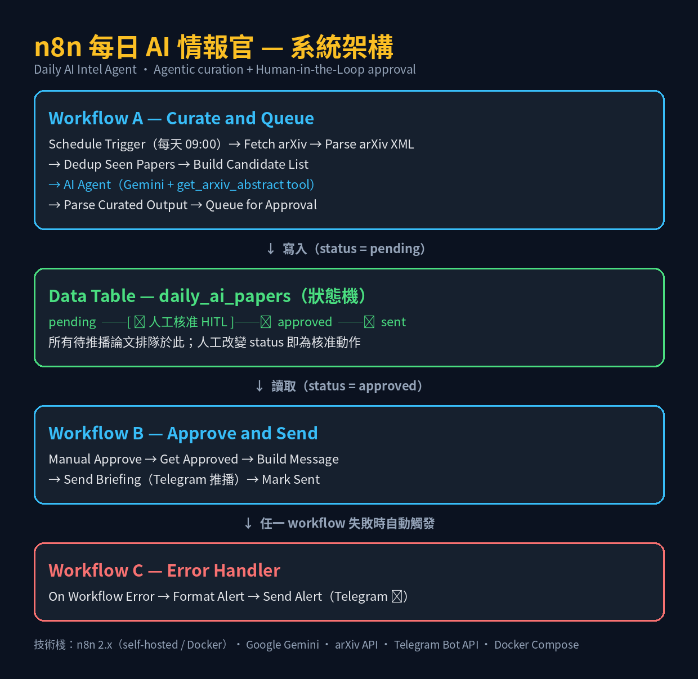

# n8n 每日 AI 情報官（Daily AI Intel Agent）

以 **n8n（self-hosted）** 打造的 AI Agent 每日情報推播系統：

> **排程抓取 arXiv 最新 AI 論文 → AI Agent 自主挑選與研究 → 人工核准 → Telegram 推送精選簡報**

本專案展示 Agentic AI workflow 的完整工程實作：**自主工具呼叫、Human-in-the-Loop 核准、冪等去重、錯誤告警與可觀測性**。

---

## 系統架構



三個 workflow 分工協作：

| Workflow | 觸發方式 | 職責 |
|---|---|---|
| **A - Curate and Queue** | 排程（每天 09:00）| 抓取 arXiv → 去重 → AI Agent 自主策展 → 寫入待核准佇列 |
| **B - Approve and Send** | 手動（人工核准後）| 讀取已核准論文 → 組訊息 → Telegram 推播 → 標記已送 |
| **C - Error Handler** | Error Trigger | 任一 workflow 失敗時發送告警到 Telegram |

資料流（items 的三種操作）：

```
展開（1 → 20）：Parse arXiv XML      把 Atom XML 拆成每篇論文一張卡
逐篇處理（20 → 5）：Dedup、AI Agent  去重與判讀在「還是一篇一張卡」時進行
收斂（5 → 3 → 1）：策展與聚合         Agent 精選 3 篇 → 一則 Telegram 訊息
```

---

## 設計亮點

### 1. Agentic Curation — AI 自主策展

AI Agent 不是執行固定流程，而是**自主決定**：

- 從 20 篇候選中挑出最值得關注的 3 篇
- **自主呼叫工具**（`get_arxiv_abstract`，透過 `$fromAI()` 由模型填入 arXiv ID）
- 一次平行發出 3 個工具呼叫，取得摘要後產出中文簡報

**可稽核性**：啟用 `Return Intermediate Steps`，每次執行的完整決策軌跡（思考 → 工具呼叫 → 觀察）都被記錄，可於 n8n 的 execution log 檢視。

### 2. Human-in-the-Loop — 人工核准（Approval Queue）

AI 負責「找與整理」，**人負責最終判斷**。狀態機設計：

```
pending  ──[ 人工核准 ]──►  approved  ──►  sent
（AI 產出）   （Data Table）    （已核准）    （已推播）
```

採用**非同步核准**（approval queue）：人不需要即時在線，有空時檢視佇列即可 —— 這正是 code review、內容審核、部署審批的通用模式。

> 設計原則：HITL 的成敗不在「有沒有閘門」，而在**閘門的 friction**。核准太麻煩，人就會繞過，HITL 淪為形式。

### 3. Idempotency — 冪等去重

使用 **Remove Duplicates** 節點（`Remove Items Seen in Previous Executions`）跨執行記憶已處理的論文（以 `link` 為鍵），確保同一篇論文不重複推送。記憶持久化於資料庫，容器重啟後依然有效。

### 4. Reliability — 錯誤處理

| 層級 | 機制 |
|---|---|
| 節點層級 | **Retry On Fail**（外部呼叫節點：Gemini、HTTP Request、Telegram）|
| 工作流層級 | **Error Workflow** → Telegram 告警（含失敗節點、錯誤訊息、執行連結）|

**實作筆記**：n8n 的 Error Trigger **只對 production（自動）執行觸發**，手動執行不會觸發（[官方文件](https://docs.n8n.io/integrations/builtin/core-nodes/n8n-nodes-base.errortrigger/)）。驗證方式：暫時將排程改為每分鐘 + 加入一個必定失敗的節點，觀察告警。

### 5. Observability — 可觀測性

- **Agent 決策軌跡**：intermediate steps 完整記錄每個工具呼叫與結果
- **Executions 頁面**：每次執行的狀態、耗時、逐節點資料流

---

## 里程碑

| # | 階段 | 內容 |
|---|---|---|
| M1 | 環境建置與核心概念 | Docker Compose 自架 n8n、item-based 資料流 |
| M2 | arXiv 抓取與解析 | HTTP Request + Code 節點解析 Atom XML、LaTeX 清理 |
| M3 | 排程 + Telegram 通知 | Schedule Trigger、credentials 管理、訊息聚合 |
| M4 | LLM 判讀 | Gemini 節點、prompt 結構化輸出、成本控制 |
| M5 | **AI Agent 自主策展** | ReAct 工具呼叫、System Message 設計、可觀測性 |
| M6 | 去重（狀態管理）| Remove Duplicates、冪等性驗證 |
| M7 | 錯誤處理與可觀測性 | Error Workflow、節點重試、告警驗證 |
| M7.5 | **HITL 人工核准** | Approval queue、Data Table 狀態機、雙 workflow 協作 |
| M8 | 交付包裝 | 架構圖、README、workflow JSON 版控 |

---

## 執行畫面

| Telegram 精選簡報 | AI Agent 決策軌跡 |
|---|---|
|  |  |

| 待核准佇列 | Workflow 畫布 |
|---|---|
|  |  |

---

## 快速開始

### 前置需求

- Docker / Docker Compose
- Telegram Bot（[BotFather](https://t.me/BotFather) 建立）→ 取得 **token** 與 **chat_id**
- Google Gemini API Key（[AI Studio](https://aistudio.google.com/app/apikey) 申請）

### 1. 啟動 n8n

```bash
cp .env.example .env
docker compose up -d
# 開啟 http://localhost:5678 並建立管理者帳號
```

### 2. 匯入 workflows

n8n → **Overview → Add workflow → ⋮ → Import from File**，依序匯入：

- `workflows/a-curate-and-queue.json`
- `workflows/b-approve-and-send.json`
- `workflows/error-handler.json`

### 3. 設定 Credentials

| Credential | 用途 | 設定 |
|---|---|---|
| **Telegram API** | 推播與告警 | Access Token = BotFather 的 token |
| **Google Gemini(PaLM) API** | AI Agent 模型 | API Key |

### 4. 建立 Data Table

**Overview → Data tables → Create Data table**，命名 `daily_ai_papers`，欄位：

| 欄位 | 型別 |
|---|---|
| `title` | String |
| `link` | String |
| `summary` | String |
| `score` | Number |
| `tag` | String |
| `status` | String（`pending` / `approved` / `sent`）|

> `id`、`createdAt`、`updatedAt` 由 n8n 自動管理，不需自行建立。

### 5. 設定與發布

1. 三個 workflow 的 Telegram 節點 → 填入你的 **Chat ID**；Gemini 節點 → 選擇可用模型（如 `gemini-3.6-flash`）
2. Workflow A → **Settings → Error Workflow** → 選 `Error Handler`
3. Workflow A 與 C → **Publish**（n8n 2.0 的發布機制，等同舊版 Active）
4. Workflow B → 保持未發布，核准後手動執行

### 6. 使用流程

```
09:00  Workflow A 自動執行 → 3 篇候選寫入 Data Table（pending）
白天   你檢視 Data Table，將要推的改成 approved
隨時   執行 Workflow B → Telegram 收到精選簡報 → 狀態改為 sent
```

---

## 目錄結構

```
n8n-daily-ai-intel-agent/
├── README.md
├── docker-compose.yml          # n8n 服務（含 volume 持久化、時區設定）
├── .env.example                # 環境變數範本
├── .gitignore
├── workflows/
│   ├── a-curate-and-queue.json # 主線：抓取 → Agent 策展 → 進佇列
│   ├── b-approve-and-send.json # 核准推播
│   ├── error-handler.json      # 錯誤告警
│   └── history/                # M2–M7 里程碑快照（系統演進紀錄）
└── docs/
    ├── architecture.png        # 系統架構圖
    └── screenshots/            # 執行畫面
```

---

## 技術棧

| 元件 | 用途 |
|---|---|
| **n8n 2.x**（self-hosted, Docker）| 工作流引擎 |
| **Google Gemini** | AI Agent 語言模型 |
| **arXiv API** | 論文資料源（公開 API）|
| **Telegram Bot API** | 推播與告警管道 |
| **n8n Data Table** | 佇列與狀態儲存（內建）|
| **Docker Compose** | 環境部署 |

---

## 實作筆記（踩坑與取捨）

- **n8n 2.0 的 Publish 機制**：Active/Inactive toggle 已移除，改為 `Publish` / `Unpublish`；**Save 只存草稿**，不會影響 production 版本。
- **Error Trigger 的限制**：僅對自動執行觸發（見上文「Reliability」段）。
- **LLM 輸出格式不保證**：實測評分欄位出現小數（4.5）→ 程式端以 `parseFloat` 容錯；需要嚴格格式時應使用 Structured Output Parser。
- **LaTeX 清理**：arXiv 摘要原始為 LaTeX 源碼（如 `$p(y \mid x)$`），以正則做「夠用」的符號轉換，其餘交由 LLM 自然語言化。
- **HITL 的環境限制**：即時核准（Telegram 按鈕）需要 webhook 可達的公開網址；本專案以 **approval queue** 模式繞過此限制，無需對外暴露服務。

---

## 授權

個人學習專案，供作品集展示使用。
